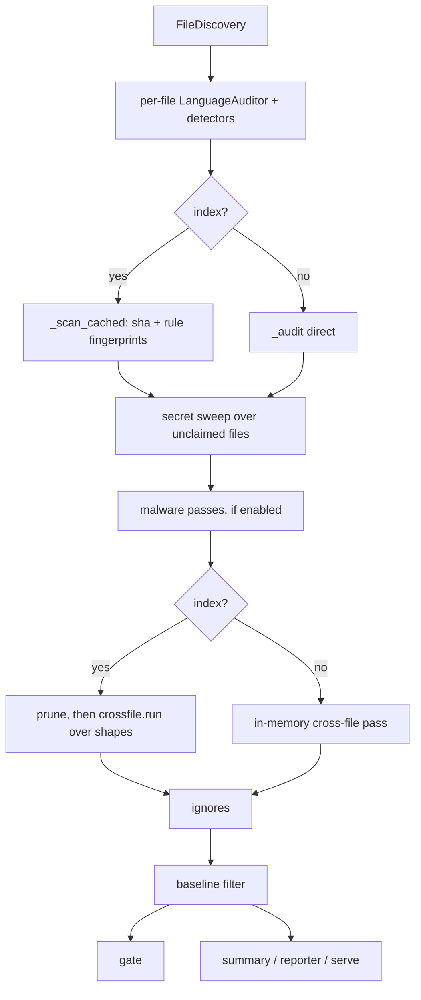

# Architecture

How the `auditr` commands, the `auditr-mcp` server, and the shared library code fit together.
Paths are relative to the repo root.

## Shape of the repo

- `auditor/cli/` is the Typer command tree. `apps.py` owns the root `app`; `cli/__init__.py` is the
  composition root that imports each command module (registering its `@app.command()`) and mounts
  the sub-apps (`index`, `ignore`, `config`, `rules`, `plugins`, `self`, `malware`, `graph`).
- `auditor/mcp/` is the FastMCP server, same shape: `server.py` owns the `mcp` instance,
  `mcp/__init__.py` imports each `*_tools` module to register its tools.
- `auditor/languages/<lang>/` is one package per language: `auditor.py` holds the `LanguageAuditor`
  subclass, `detectors/` holds modules whose `Detector` subclasses register on import. Languages
  today: python (`.py`, `.pyi`), typescript, shell (`.sh`, `.bash`), config (data and config
  suffixes), manifest (`package.json`).
- `auditor/database/` is the SQLite layer: `base.py` (worker, table DSL, `BaseDB`), one module per
  table, `store.py` (the `IndexStore` facade).
- `auditor/graph/` is the semantic graph, part of the core install; `auditor/graph/ui/` is the Vite
  frontend `graph serve` embeds, and `auditor/graph/refine/` the refinement layer.
- `auditor/malware/` wraps the opt-in ClamAV and osv-scanner shell-outs, `auditor/reporters/` holds
  one module per output format, and `auditor/profiles/*.toml` the built-in config profiles
  (`base`, `strict`, `pydantic`, `all-strict`).
- `auditor/observer/` holds the daemon and the change assessment. `assess.py` classifies an edit
  batch against the graph and `budget.py` turns a window's spend into day-ceiling state; both are
  pure. The process is `daemon.py` (the singleton flock, `daemon.json`, the idle timer, the restart
  exec), `server.py` (stdlib `ThreadingHTTPServer` on loopback, transport only), `routes.py` (one
  method and path to one `Reply`, routing only), `events.py`, `sessions.py` and `payloads.py`. One
  rule holds the design together: the spool is the truth and the in-memory set is only the wakeup,
  so `POST /events` writes `repos/<key>/spool.jsonl` before it answers 202 and a daemon killed
  after that loses nothing. `auditr_observer.py` is the client, at the repo root outside the
  package so it never imports `auditor`; `auditr observer` is the same surface as a lazy CLI mount.
- Everything else at `auditor/` top level is a shared seam, described next.
- `tests/` mirrors the package; `plugin/` is the Claude Code plugin (skills, subagent, hooks,
  statusline, bundled MCP config); `assets/` holds the project icon and the vendored runner marks
  (see `assets/README.md`).

## Shared seams

- `discovery.py`: `find_root` walks up for `.git` / `pyproject.toml` / `.auditor`. `FileDiscovery`
  lists auditable files through `git ls-files` inside a repo or an `rglob` walk outside one, minus
  hard-excluded dirs, generated-file globs and the configured `exclude`. `auditable(path)` answers
  the same question for one path, `auditable_paths(paths)` batches the git call for a set, and
  `auditable_shape(path)` is the shape half with no subprocess. `default_base_ref` and
  `git_changed_files` back the diff flags; `git_output` is the shared one-shot git call.
- `config.py`: `AuditorSettings` (pydantic-settings) is the merged repo config. `load_config`
  layers profile, `pyproject [tool.auditor]`, `.auditor/config.toml`, then injected overrides,
  loading plugins between the raw read and validation so a config may name plugin-contributed
  rules. `ResolvedConfig.effective(rule_id)` resolves one rule for one file. `GlobalPaths` reads
  the `AUDITOR_*` env vars. See [configuration.md](references/configuration.md).
- `user_settings.py`: `UserSettings` (`AUDITOR_USER_` prefix) holds the personal `observer` and
  `vectors` settings, layered by `load_user_settings(root)`. A second settings home on purpose, so
  repo policy and personal settings never share a model or a file.
- `registry.py`: the process-wide `REGISTRY` singleton. Detectors, `LanguageAuditor`s and
  `Reporter`s self-register via `__init_subclass__`; `builtins.py` is the single bootstrap import.
- `roles.py`: `RoleClassifier` labels each file production, test, test_support, script or
  generated from path globs plus parsed content. The role picks the policy `ResolvedConfig` applies.
- `models.py`: the shared records `Finding`, `ScanResult`, `ManifestEntry`, `IndexEntry`,
  `Partition`, and the `Severity` / `VerdictKind` / `FileRole` enums.
- `paths.py`: `auditor_home()`, `index_db_path()`, `repo_key()` (the index partition key),
  `partition_for()` (the checkout identity plus its toplevel-relative prefix), and the user-home
  layout (`user_config_path()`, `repo_identity()`, `repo_dir_key()`, `repo_dir()`). The repo dir is
  keyed by sha1 of the resolved git common dir, so worktrees of one checkout share it.
- `database/store.py`: `IndexStore.connect(db_path, repo_key)` opens the shared db and binds the
  handle to one repo's partition; `database/base.py`'s `SqliteWorker` owns the one thread-bound
  connection, so writes serialize. `database.open_repo_index(root)` is the one place "scoped to
  this repo's partition and bound to this checkout's identity" is written.
- `skips.py`, `ignores.py`, `baseline.py`: the suppression seams; `gate.py` is the gate they feed.
- `reporters/base.py`: the `Reporter` ABC and `render(results, fmt)`. `serve.py` (`ReportServer`)
  serves a rendered page on an ephemeral `127.0.0.1` port and never binds a public interface.
- `cli/helpers.py`: `present` (pretty at a TTY, raw JSON otherwise), the asyncio bridge, `emit`,
  `open_index`, `fail`, `load_settings` and `cli_root`, the one root resolution every command goes
  through. `cli/payloads.py` holds one frozen model per command payload, `cli/render.py` one
  renderer per payload, `cli/options.py` the shared Typer annotations. `payload.py` holds the
  `WirePayload` / `WireRows` shells they build on; the graph payloads live beside their query in
  `graph/payloads.py` and `graph/refine/payloads.py`.
- `config_notice.py`: `ConfigNotice` plus the process-wide `NOTICE`. The root Typer callback
  flushes the unknown-key warnings as one stderr block per invocation; the MCP server's
  `ConfigNoticeMiddleware` prints them once per repo. No command formats the warning itself.
- Library entry points: `engine.audit_target` and `reporters.render`, both re-exported from
  `auditor`. See [python-api.md](references/python-api.md).

## scan

`cli/scan.py` calls `engine.audit_target`, which drives `engine.ScanEngine`. See
[scan.md](references/scan.md).

- `cli/scan.py` validates `--format` before scanning, configures logging, resolves the diff ref
  (`--since`, `--changed`, `--vs-base`) to a changed-file set, and folds `--config-json` plus
  `--malware` into the config overrides. A diff mode turns on `--incremental`.
- `engine.audit_target` resolves the root and config, folds the flag-shaped settings into
  `AuditorSettings`, and decides whether to open the index.
- `ScanEngine.scan_path` runs the directory pipeline; `scan_file` is the isolated single-file path
  and `scan_file_indexed` re-audits one file, then re-runs the cross-file pass over the persisted
  shapes so a single-file scan still sees repo-level findings.
- Per file, `_scan_file` classifies the role, builds `ResolvedConfig`, picks the `LanguageAuditor`
  by path, and partitions that language's detectors into enabled (each with a per-rule fingerprint)
  and skipped. `_scan_files` audits with bounded concurrency.
- With an index, `_scan_cached` compares the content hash and each rule fingerprint, re-runs only
  the rules that missed, then writes back the file row, the findings, the shape rows, and the graph
  facts when `[tool.auditor.graph]` is on.
- `skips.filter_findings` drops directive-suppressed findings before the index stores them, so
  cached rescans stay consistent.
- `_sweep_unclassified_for_secrets` then runs the config secret detectors over every non-binary
  file no language auditor claimed, and `malware.passes.run_malware_passes` runs when enabled.
- With an index, `IndexStore.prune` drops rows for files gone from this scan's scope and
  `crossfile.run` recomputes the repo-level findings from the shapes table; without one,
  `_apply_crossfile_in_memory` does the same in memory. `engine._apply_ignores` filters persistent
  ignores last.
- Back in `cli/scan.py`: `--write-baseline` writes and exits; a directory scan writes the `scan`
  block of `status.json`; `--baseline` hides recorded findings; `gate.gate_tripped` decides the
  exit code; `--severity`, `--min-severity` and `--rule` filter the display only; then
  `cli/summary.print_summary`, `reporters.render`, or `ReportServer`.

## report, manifest, discover

- `cli/report.py` calls the same `engine.audit_target` on one file with cross-file off, so it is
  stateless: no index writes, no cross-file findings. It defaults to `-f json`, unlike `scan`.
  See [report.md](references/report.md).
- `cli/manifest.py` parses with `ast` and builds `models.ManifestEntry.from_module`. No detectors,
  no config load, Python only. See [manifest.md](references/manifest.md).
- `cli/discover.py` loads the config, lists `FileDiscovery.files(target)` and labels each path with
  `RoleClassifier`, auditing nothing. See [discover.md](references/discover.md).

## aggregate, crossfile

- `cli/aggregate.py` opens the repo's index partition and hands it to `aggregate.AuditAggregator`,
  which reconstructs per-file results from the cached rows, applies ignores, and renders one
  `AUDIT.md`. It never re-scans. See [aggregate.md](references/aggregate.md).
- `cli/crossfile.py` derives the repo's inputs with `crossfile.CrossFileInputs` and runs the pass
  against the index. `ScanEngine` holds the same object, so both report the same count.
  `crossfile.run` groups the `shapes` table for duplicate models and functions within a role, then
  merges the pure passes: `settings_cohesion.find_scattered`, `fixture_usage.find_unused`,
  `dead_code.find_dead` and `private_usage.find_leaked_private`. See
  [crossfile.md](references/crossfile.md).

## index, ignore, config, init

- `cli/index.py` (`add`, `list`, `repos`, `forget`) is the direct handle on the shared db. `add`,
  `list` and `forget` resolve the repo partition through `paths.repo_key`; `repos` opens the db
  unpartitioned. See [index.md](references/index.md).
- `cli/ignore.py` (`add`, `list`, `rm`, `clear`) writes rows to the `ignores` table, validating the
  rule id against `REGISTRY` unless `--force`. A line-level add snapshots the offending text, so
  `ignores.IgnoreList` matches on that hash first and the literal line second. See
  [ignore.md](references/ignore.md).
- `cli/config.py` (`show`, `check`) runs `config.load_config` for the resolved root and dumps the
  merged `AuditorSettings`, or the resolved `UserSettings` under `--user`. See
  [config.md](references/config.md).
- `cli/init.py` creates `$AUDITOR_HOME`, writes `config.json`, regenerates `config.schema.json`
  from `UserSettings.model_json_schema()`, and with `--repo` creates the per-repo overlay and its
  breadcrumb. See [init.md](references/init.md).

## rules, plugins

- `cli/rules.py` (`list`) reads `REGISTRY` directly and validates its filters against it. See
  [rules.md](references/rules.md).
- `cli/plugins.py` (`list`) constructs a `PluginLoader`, runs a config load through it, and prints
  `REGISTRY.snapshot()` plus the loader's warnings. `plugins.PluginLoader` discovers plugins from
  the `auditor.*` entry-point groups, from modules named in the config, and from
  `.auditor/plugins/*.py`, which execute repo code and so load only under `trust_local_plugins` or
  `--allow-local-plugins`. The contract is the ABCs themselves. See
  [plugins.md](references/plugins.md).

## malware

- `cli/malware.py` (`status`, `install`, `update-dbs`) manages the backends only; the scan itself
  rides `auditr scan --malware` or `[tool.auditor.malware_scan]`. See
  [malware.md](references/malware.md).
- `malware/tools.py` resolves each binary from `$AUDITOR_HOME/bin` first, then `PATH`. Those
  versions fold into the cache fingerprint, so a database refresh invalidates exactly the malware
  rows.
- `malware/passes.py` runs `clamav.py` over the files `malware/walk.py` enumerates and `osv.py`
  over the repo's lockfiles; `malware/rules.py` registers the rule ids.
- `install` and `update-dbs` are the only networked commands in the subsystem; nothing networked
  runs at scan time. `install.py` verifies a pinned osv-scanner download against the release
  SHA256SUMS and leaves ClamAV to the platform package manager.

## graph

- `cli/__init__.py` mounts `graph` through `cli/lazy.py`'s `LazyGraphGroup`, which imports
  `cli/graph.py` on the first graph subcommand, so numpy, scikit-learn and networkx never load for
  the other commands. A broken graph dependency surfaces as a one-line error naming `auditr graph`,
  and the failed import is cached. `cli/graph_refine.py` holds `unresolved`, `refine`, `eval`,
  `log` and `refinements`, registered from the bottom of `cli/graph.py` in one direction only.
  See [graph.md](references/graph.md).
- `graph build` auto-scans with graph extraction forced on, then runs `build.GraphBuilder.run` over
  the cached facts: dedupe nodes, `resolve_edges.resolve_structural`, `naming.name_similar_edges`
  (tf-idf plus LSI), `usage.usage_similar_edges` (callee and operand-type Jaccard), `rank.pagerank`,
  `cluster.cluster_concepts`, `detectors.run_graph_detectors`, then persist through one
  `IndexStore.transaction`. `build.GraphWrite` is that whole result as one frozen record, so the
  empty-graph build takes the same path.
- The write is one commit on purpose: an interrupted build must not leave a new node set beside the
  previous run's queue or findings.
- `GraphBuilder.rebuild` holds `$AUDITOR_HOME/observer/locks/<sha1(identity)>.lock` for the whole
  build, one lock per checkout, polled with `fcntl.flock(LOCK_EX | LOCK_NB)` so a waiting caller
  stays interruptible. POSIX only.
- `resolve_edges.StructuralResolver` resolves names into edges; the facts it cannot place go to its
  `UnresolvedCollector`, which materializes the `graph_unresolved` rows. The build pass adds the
  `text_sparse`, `generic_label` and `singleton_cluster` rows after clustering.
- `graph/hashes.py` derives the per-node hashes from the extracted facts: `truth_sha` over the fact
  tuples structural edges read (it decides run gating and anchor drift) and `facts_sha` over those
  plus `doc_tokens` (it decides whether similarity edges rebuild). Names a node binds are
  subtracted before hashing, so a refinement survives a comment, a reformat and a renamed local.
- `graph/refine/` is the refinement layer. Its pure half is stdlib, pydantic and `config.py` with
  no database: `models.py` (the frozen records), `namespace.py` (the node id), `overlay.py` (the
  merge one build applies), `lock.py`, `verify.py` (the AST-fact check), `tiers.py` (shape to tier),
  `conflicts.py` (the commit-time collision check), `facts.py` (the reader and `BriefBuilder`),
  `prompts.py` and `brief.py`.
- Above it: `runner.py` (the producer ABC plus `FakeRunner`), `sdk_runner.py` (the Claude producer,
  deliberately SDK-free), `sdk_client.py` (the only importer of `claude_agent_sdk`), `eval.py`
  (what `auditr graph eval` measures) and `drive.py` (the runner choice and the one `refine` call
  both surfaces make, and the single `observer-claude` import guard). That import order is
  one-directional and enforced by module-top imports.
- `refine/service.py` is the lifecycle: `begin` writes a `graph_runs` row with the branch and HEAD
  it started against, `propose` verifies and stages in memory (storing a rejection immediately, so
  an aborted run still explains itself), and `commit` takes the rebuild lock once and does the git
  guard, the conflict checks, the inserts and `GraphBuilder.rebuild` inside it, as one transaction.
  `RefinementLedger` is the by-hand half over the index handle alone: `accept`, `revert`, `pin` and
  `prune` are status transitions, because the build is the one merge point.
- `GraphBuilder.run` is the only place refinements are applied. `overlay.Overlay.for_build` triages
  the active rows against their anchors; its passes merge edge kinds into the resolver's output,
  apply the node and cluster kinds, and retire the queue rows a refinement answered. The `GRAPH-*`
  detectors get a second pass over the edge list captured before the overlay, so no finding depends
  on a refinement.
- `graph/query.py`'s `GraphQuery` answers `related`, `neighbors`, `concept`, `clusters`, `search`
  and `usages` off the persisted tables; `LogQuery` is the provenance reader both `graph log` and
  the MCP tools page through, so neither can drift on ordering or on what a time window means.
- `graph.flow.build_flow` walks the persisted graph breadth-first over `calls` and `callback_arg`,
  expanding overriders and registry members as `dispatches_to`, pruned by depth, node limit, test
  role, `--stop-at` globs and the `flow_hub_fan_in` floor. Every knob travels as one frozen
  `FlowOptions`.
- `graph/cache.py` holds `GraphCache`, the per-query index of every node and edge in a partition.
  It is a leaf: `flow.py` and `query.py` import it and nothing imports back.
- `graph serve` renders `graph.viz.build_payload` into the bundled UI on `ReportServer`, rebuilding
  only when no graph exists or `--rebuild` is passed. `graph export` emits Graphviz DOT, or SVG by
  piping it through the system `dot`.
- `graph/extract.py`, `graph/model.py`, `graph/cache.py` and `graph/flow.py` are stdlib plus
  pydantic and never touch numpy, which only `build.py`, `naming.py`, `usage.py`, `rank.py` and
  `cluster.py` import.

## self, version

- `cli/self_update.py` (`update`) queries PyPI, compares versions, and reconstructs the install
  command from how `auditr` was installed: a `uv tool` receipt takes a `uv tool` upgrade, anything
  else takes pip. See [self.md](references/self.md).
- `cli/version.py` resolves the installed distribution version, falling back to
  `auditor.__version__` in a source checkout. At a TTY it adds a short-timeout PyPI check that
  degrades to "offline"; piped, it prints `auditr <version>` and skips the network.

## auditr-mcp

- `auditor/mcp_server.py` re-exports `main` and `mcp` from `auditor/mcp/`. `mcp/server.py` builds
  the `FastMCP` instance and caps any single tool response at `MAX_TOOL_RESPONSE_BYTES`. See
  [auditr-mcp.md](references/auditr-mcp.md).
- The tool modules mirror the CLI: `scan_tools.py`, `rules_tools.py`, `ignore_tools.py`,
  `malware_tools.py`, `refine_tools.py` and `graph_tools.py`. Every module registers
  unconditionally.
- Every tool carries a `READ_ONLY`, `MUTATING` or `DESTRUCTIVE` annotation from `mcp/helpers.py`.
  None declare an open world; the tools touch the local repo only.
- Payloads too large to inline are published through `mcp/artifacts.py` and returned as a
  `ResourceLink`; resource reads bypass the tool-response cap.
- `mcp/helpers.py` owns the preamble every tool shares: `tool_repo(path)` resolves the root and
  yields a `ToolRepo` holding an index handle bound to that root's partition and identity, loading
  the repo policy first and once. `rules_tools.rules_list` is synchronous and so sits outside it,
  as does `ConfigNoticeMiddleware`, which resolves its own root.
- `mcp/code_mode.py` stays off unless both the `code-mode` extra is installed and
  `AUDITOR_CODE_MODE` is set.

## Claude Code plugin

- `plugin/` is a self-contained Claude Code plugin; the root `.claude-plugin/marketplace.json`
  publishes it. See [claude-code-plugin.md](references/claude-code-plugin.md).
- `plugin/.claude-plugin/plugin.json` points at `plugin/skills/`, `plugin/agents/`, and
  `plugin/.mcp.json` (a `uvx`-launched `auditr-mcp`). `plugin/settings.json` wires the status line
  and `plugin/hooks/hooks.json` the three stdlib hooks (`session_start.py`, `audit_edit.py`,
  `verify_stop.py`).
- `plugin/statusline/auditor_status.py` re-implements `discovery.find_root`, `paths.repo_identity`,
  `paths.repo_dir_key` and `paths.auditor_home` in stdlib only, then reads the `scan` block of
  `$AUDITOR_HOME/repos/<key>/status.json`. `tests/plugin/test_statusline.py` pins each pair.

## Cross-cutting behavior

- Incremental index: `--incremental` opens the shared db and caches per file. A file's cached
  findings for one rule stay valid while both the file's sha256 and that rule's fingerprint are
  unchanged; `fingerprints.rule_fingerprint` folds in the detector's `version` and the rule's
  effective config, so editing one threshold invalidates exactly that rule.
- Index location: one SQLite database at `$AUDITOR_HOME/index.db`, partitioned by `paths.repo_key`.
  `database/base.py` holds `SCHEMA_VERSION`.
- Two table classes, declared by `Table.cache`. Partition tables (`cache=True`) are dropped and
  rebuilt by the next scan on a version change. Identity tables (`cache=False`) are never dropped:
  `repos`, `ignores` and the `graph_*` refinement tables, whose declared columns
  `IndexStore._migrate_identity_tables` reconciles with `ALTER TABLE` on every connect.
- A column added to an identity table after it ships must be nullable or carry a default, must not
  be a `PRIMARY KEY`, and must not carry `REFERENCES`. SQLite refuses the other shapes, so the
  migrator raises `UnmigratableColumn` and the CLI turns that into a one-line repair instruction.
- The version bump is one `BEGIN IMMEDIATE` transaction in a fixed order: reconcile the identity
  tables, drop the cache tables, create what is missing, stamp `user_version` last. A declaration
  that cannot land leaves the stored version and every cached row untouched.
- A stored version of 0 on a database that already has cache tables is a lost stamp, not a fresh
  database, so it rebuilds like any other mismatch. Only an empty file skips the sweep.
- A downgrade leaves the identity tables intact but unreferenced; `graph build --rebuild` clears
  cached facts and never touches them.
- The identity tables key on `repo_identity` (the resolved git common dir), not on the partition,
  so every worktree of a checkout shares them and `index forget` cannot cascade into them.
- Repo-local state: `<repo>/.auditor/` holds authored input only (`config.toml`, `plugins/`, a
  baseline file). Nothing is written into the repo: generated state is the shared index plus
  `$AUDITOR_HOME/repos/<repo_dir_key>/`.
- Verdict kinds: a detector emits `auto` (decided deterministically) or `candidate` (evidence only,
  for an agent to judge). `gate.gate_tripped` counts `auto` findings at or above `--fail-on`, so a
  candidate never breaks CI on its own.
- Suppression order: in-file `# auditor: skip` directives apply inside the engine before anything is
  cached, persistent db-backed ignores apply after the scan, and a baseline snapshot applies in the
  CLI before the gate. See [ignore.md](references/ignore.md) and [scan.md](references/scan.md).
- Machine versus human output: `scan` prints the summary from `cli/summary.py` unless `-f` or `-o`
  asks for a format; `report` defaults to json. The inspection commands go through
  `helpers.present`, which renders pretty at a TTY and raw JSON when piped or given `--json`. All
  logging and spinners go to stderr, so stdout stays parseable.
