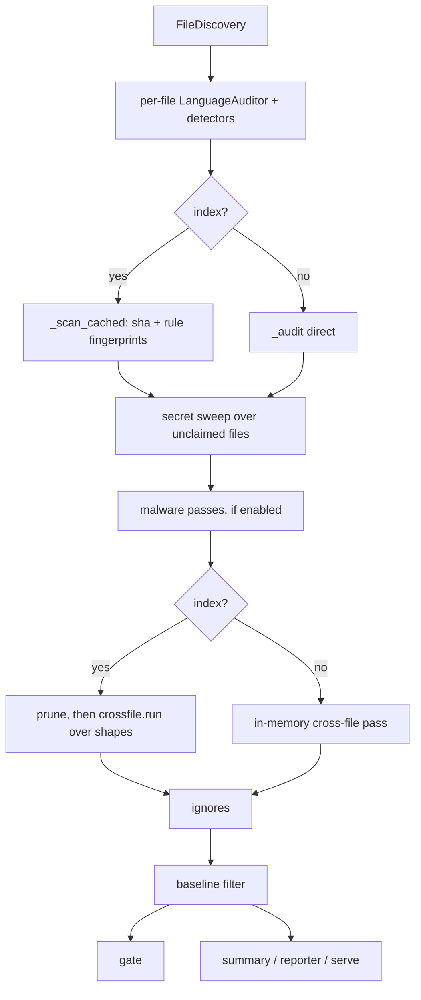

# Architecture

How the `auditr` commands, the `auditr-mcp` server, and the shared library code fit together.
Paths are relative to the repo root.

## Shape of the repo

- `auditor/cli/` is the Typer command tree. `apps.py` owns the root `app`; `cli/__init__.py` is the
  composition root that imports each command module (registering its `@app.command()`) and mounts
  the sub-apps (`index`, `ignore`, `config`, `rules`, `plugins`, `self`, `malware`, `graph`).
- `auditor/mcp/` is the FastMCP server, same shape: `server.py` owns the `mcp` instance,
  `mcp/__init__.py` imports each `*_tools` module to register its tools.
- `auditor/languages/<lang>/` is one package per language: `auditor.py` holds the `LanguageAuditor`
  subclass, `detectors/` holds modules whose `Detector` subclasses register on import. Languages
  today: python (`.py`, `.pyi`), typescript, shell (`.sh`, `.bash`), config (data and config
  suffixes), manifest (`package.json`).
- `auditor/database/` is the SQLite layer: `base.py` (worker, table DSL, `BaseDB`), one module per
  table, `store.py` (the `IndexStore` facade).
- `auditor/graph/` is the semantic graph, part of the core install since its libraries moved out
  of the `[graph]` extra; `auditor/graph/ui/` is the Vite frontend `graph serve` embeds.
- `auditor/cli/lazy.py` holds `LazyGroup`, the deferred sub-app mount, and `auditor/observer/` the
  observer package. `auditr_observer.py` is the observer's client and lives at the repo root,
  outside the package, so it never imports `auditor`.
- `auditor/malware/` wraps the opt-in ClamAV and osv-scanner shell-outs. `auditor/reporters/` holds
  one module per output format. `auditor/profiles/*.toml` holds the built-in config profiles
  (`base`, `strict`, `pydantic`, `all-strict`).
- Everything else at `auditor/` top level is a shared seam or is described under the command that
  owns it.
- `tests/` mirrors the package; `plugin/` is the Claude Code plugin (skills, subagent, hooks,
  statusline, bundled MCP config).

## Shared seams

- `discovery.py`: `find_root` walks up for `.git` / `pyproject.toml` / `.auditor`. `FileDiscovery`
  lists auditable files through `git ls-files` (exact `.gitignore` handling) or an `rglob` walk
  outside a repo, minus hard-excluded dirs, default generated-file globs, and the configured
  `exclude`. `default_base_ref` and `git_changed_files` back the diff flags, and `git_output` is
  the shared one-shot git call `paths.repo_identity` uses.
- `config.py`: `AuditorSettings` (pydantic-settings) is the merged repo config. `load_config`
  layers profile, `pyproject [tool.auditor]`, `.auditor/config.toml`, then injected overrides,
  loading plugins between the raw read and validation so a config may name plugin-contributed
  rules. `ResolvedConfig.effective(rule_id)` resolves one rule for one file (rule, category, role
  policy, per-glob override). `GlobalPaths` reads the `AUDITOR_*` env vars. See
  [configuration.md](references/configuration.md).
- `user_settings.py`: `UserSettings` (pydantic-settings, `AUDITOR_USER_` prefix) holds the
  personal `observer` and `vectors` settings. `load_user_settings(root)` layers the model
  defaults, `$AUDITOR_HOME/config.json`, `$AUDITOR_HOME/repos/<key>/config.json` and the env, in
  that order. It is a second settings home on purpose, so repo policy and personal settings never
  share a model or a file.
- `registry.py`: the process-wide `REGISTRY` singleton. Detectors, `LanguageAuditor`s and
  `Reporter`s self-register via `__init_subclass__`; `builtins.py` is the single bootstrap import
  that pulls the built-ins in.
- `roles.py`: `RoleClassifier` labels each file production, test, test_support, script, or
  generated from path globs plus parsed content. The role picks the policy `ResolvedConfig`
  applies, so tests are classified rather than dropped.
- `models.py`: the shared records `Finding`, `ScanResult`, `ManifestEntry`, `IndexEntry`, and the
  `Severity` / `VerdictKind` / `FileRole` enums.
- `database/store.py`: `IndexStore.connect(db_path, repo_key)` opens the shared db and binds the
  handle to one repo's partition. `database/base.py`'s `SqliteWorker` owns the one thread-bound
  connection; every store awaits through it, so writes serialize safely.
- `paths.py`: `auditor_home()`, `index_db_path()`, `repo_key()` (the index partition key),
  `read_json_dict()` (the one tolerant JSON-object reader the home's files share), and the
  user-home layout: `user_config_path()`, `user_schema_path()`, `models_dir()`, plus
  `repo_identity()` / `repo_dir_key()` / `repo_dir()` / `ensure_repo_dir()`. The repo dir is keyed
  by sha1 of the resolved git common dir, so worktrees of one checkout share it and a symlinked or
  moved path does not mint a second one.
- `skips.py`, `ignores.py`, `baseline.py`: the three suppression seams; `gate.py` is the gate they
  feed (see Cross-cutting behavior).
- `reporters/base.py`: the `Reporter` ABC and `render(results, fmt)`. `serve.py` (`ReportServer`)
  serves a rendered page on an ephemeral `127.0.0.1` port and never binds a public interface.
- Library entry points: `engine.audit_target` and `reporters.render`, both re-exported from
  `auditor`. See [python-api.md](references/python-api.md).
- `cli/helpers.py`: `present` (pretty at a TTY, raw JSON otherwise), `run` / `run_staged` /
  `run_live` (the asyncio bridge plus the stderr spinner), `emit`, `open_index`, `fail`.
  `cli/render.py` holds one `render_*` function per payload; `cli/options.py` holds the shared
  Typer annotations.

## scan

`cli/scan.py` calls `engine.audit_target`, which drives `engine.ScanEngine`. See
[scan.md](references/scan.md).

- `cli/scan.py` validates `--format` before scanning, configures logging, resolves the diff ref
  (`--since`, `--changed`, `--vs-base`) to a changed-file set via `discovery.git_changed_files`,
  and folds `--config-json` plus `--malware` into the config overrides. A diff mode turns on
  `--incremental` so the whole-repo scan stays cheap.
- `engine.audit_target` resolves the root and config, folds the flag-shaped settings
  (`--strict-tests`, `--no-skips`, `--include-gitignored`, `--exclude`) into `AuditorSettings`, and
  decides whether to open the index.
- `ScanEngine.scan_path` runs the directory pipeline below. `scan_file` is the isolated single-file
  path; `scan_file_indexed` re-audits one file and then re-runs the cross-file pass over the
  already-persisted shapes, so a single-file scan still sees repo-level findings.
- Per file, `ScanEngine._scan_file` classifies the role, builds `ResolvedConfig`, picks the
  `LanguageAuditor` by path, and partitions that language's detectors into enabled (each with a
  per-rule fingerprint) and skipped.
- `_scan_files` audits with bounded concurrency and reports progress into the spinner.
- With an index, `_scan_cached` compares the content hash and each rule fingerprint, re-runs only
  the rules that missed, then writes back the file row, the per-rule findings, the shape rows, and
  the graph facts when `[tool.auditor.graph]` is on.
- `_audit` runs the language auditor, then `skips.filter_findings` drops directive-suppressed
  findings before the index stores them, so cached rescans stay consistent.
- After the file pass, `_sweep_unclassified_for_secrets` runs the config secret detectors over
  every non-binary file no language auditor claims, so a credential in a `.md` or `.sql` file is
  still caught.
- `malware.passes.run_malware_passes` runs only when `malware_scan.enabled`.
- With an index, `IndexStore.prune` drops rows for files that no longer exist under this scan's
  scope, then `crossfile.run` recomputes the repo-level findings from the shapes table. Without an
  index, `_apply_crossfile_in_memory` recomputes shapes in memory so a stateless directory scan
  still reports them.
- `engine._apply_ignores` filters persistent ignores before results leave `audit_target`.
- Back in `cli/scan.py`: `--write-baseline` writes and exits; a directory scan writes the `scan`
  block of `$AUDITOR_HOME/repos/<key>/status.json` through `status.write_status`; `--baseline`
  hides recorded findings; `gate.gate_tripped` decides the exit code; `--severity`,
  `--min-severity` and `--rule` filter the display only; then `cli/summary.print_summary`,
  `reporters.render`, or `ReportServer`.

## report

- `cli/report.py` calls the same `engine.audit_target` on one file with cross-file left off, so it
  is stateless and isolated: no index writes, no cross-file findings. See
  [report.md](references/report.md).
- Output defaults to `-f json` (the agent-facing contract), unlike `scan`, whose default is the
  human summary.

## manifest

- `cli/manifest.py` parses the file with `ast` and builds `models.ManifestEntry.from_module`. No
  detectors, no config load, Python only. See [manifest.md](references/manifest.md).

## discover

- `cli/discover.py` loads the config, lists `FileDiscovery.files(target)`, and labels each path
  with `RoleClassifier`. It answers what a scan would cover and how strictly each file would be
  treated, without auditing anything. See [discover.md](references/discover.md).

## aggregate

- `cli/aggregate.py` opens the repo's index partition and hands it to `aggregate.AuditAggregator`.
  See [aggregate.md](references/aggregate.md).
- `AuditAggregator` reconstructs per-file results from the cached `files` and `findings` rows,
  applies persistent ignores, and renders one `AUDIT.md` with severity totals, a per-file table,
  and the candidates to judge. It never re-scans, so `scan --incremental` has to have run first.

## crossfile

- `cli/crossfile.py` runs `crossfile.run` against the index alone and reports how many findings it
  wrote. See [crossfile.md](references/crossfile.md).
- `crossfile.run` clears the repo-level rules' rows, groups the `shapes` table for duplicate models
  and functions within a role, then merges four pure passes: `settings_cohesion.find_scattered`,
  `fixture_usage.find_unused`, `dead_code.find_dead`, and `private_usage.find_leaked_private`. It
  re-parses nothing.

## index

- `cli/index.py` (`add`, `list`, `repos`, `forget`) is the direct handle on the shared db: register
  an audit scope, list per-file rows, list every registered repo, drop this repo's cached rows. See
  [index.md](references/index.md).
- `add`, `list` and `forget` resolve the repo partition through `paths.repo_key`; `repos` opens the
  db unpartitioned via `helpers.open_shared_index`.

## ignore

- `cli/ignore.py` (`add`, `list`, `rm`, `clear`) writes rows to the `ignores` table. `add`
  validates the rule id against `REGISTRY` unless `--force`. See [ignore.md](references/ignore.md).
- A line-level add calls `engine.finding_evidence_at` to snapshot the offending text.
  `ignores.IgnoreList` then matches on that hash first and the literal line second, so the ignore
  follows the code when lines shift.
- Scope widens as fields are left off: no `--file` is repo-wide, `--file` alone is file-wide,
  `--file` plus `--line` is one finding.

## config

- `cli/config.py` (`show`, `check`) runs `config.load_config_report` for the resolved root and
  dumps the merged `AuditorSettings`. It is how you see which layer won. `--user` dumps the
  resolved `UserSettings` instead, and `check` reports the keys no model declares in either. See
  [config.md](references/config.md).

## init

- `cli/init.py` creates `$AUDITOR_HOME`, writes `config.json` with only `$schema` and
  `config_version`, regenerates `config.schema.json` from `UserSettings.model_json_schema()`, and
  with `--repo` creates `paths.ensure_repo_dir(root)` plus its overlay. See
  [init.md](references/init.md).
- `--check` writes nothing and reports unknown keys, a breadcrumb whose root has vanished, and a
  leftover `<repo>/.auditor/.status.json`; `--migrate` rewrites that breadcrumb and
  `--clean-status` deletes that file.

## rules

- `cli/rules.py` (`list`) reads `REGISTRY` directly: rule id, category, framework, default
  severity, verdict kind, standard refs, and whether the rule came from a plugin. Category,
  standard and framework filters are validated against the registry. See
  [rules.md](references/rules.md).

## plugins

- `cli/plugins.py` (`list`) constructs a `PluginLoader`, runs a config load through it, and prints
  `REGISTRY.snapshot()` plus the loader's warnings. See [plugins.md](references/plugins.md).
- `plugins.PluginLoader` has three discovery paths: the `auditor.*` entry-point groups, modules
  named in the config's `plugins` list, and `.auditor/plugins/*.py`. Local plugins execute repo
  code, so they load only under `trust_local_plugins` or `--allow-local-plugins`.
- The plugin contract is the ABCs themselves: subclass `Detector`, `LanguageAuditor` or `Reporter`
  and `__init_subclass__` registers it.

## malware

- `cli/malware.py` (`status`, `install`, `update-dbs`) manages the backends only. The scan itself
  rides `auditr scan --malware` or `[tool.auditor.malware_scan]`. See
  [malware.md](references/malware.md).
- `malware/tools.py` resolves each binary from `$AUDITOR_HOME/bin` first, then `PATH`, and reports
  versions. Those versions fold into the cache fingerprint, so a database refresh invalidates
  exactly the malware rows.
- `malware/passes.py` runs two passes at scan time: `clamav.py` over the files `malware/walk.py`
  enumerates (no gitignore filter, vendored dirs included by default), and `osv.py` over the repo's
  lockfiles. `malware/rules.py` registers the rule ids so `rules list`, config and SARIF
  descriptors know them.
- `install` and `update-dbs` are the only networked commands in the subsystem; nothing networked
  runs at scan time. `install.py` downloads a pinned osv-scanner binary and verifies it against the
  release SHA256SUMS; ClamAV is left to the platform package manager, whose command the CLI runs
  after confirmation.

## graph

- `cli/__init__.py` mounts `graph` through `cli/lazy.py`'s `LazyGraphGroup`, which imports
  `cli/graph.py` on the first graph subcommand, so numpy, scikit-learn and networkx never load
  for the other commands. See [graph.md](references/graph.md).
- A broken graph dependency surfaces as a one-line click error naming `auditr graph`, not a
  traceback, and the failed import is cached, so a second dispatch repeats that error instead
  of presenting an empty group as a working one.
- `graph build` auto-scans first with graph extraction forced on (skip with `--no-scan`), then runs
  `graph.build.GraphBuilder.run` over the cached per-file facts: dedupe nodes,
  `resolve_edges.resolve_structural` (returning a `StructuralResult` of deterministic edges plus the
  facts it could not place), `naming.name_similar_edges` (tf-idf plus LSI),
  `usage.usage_similar_edges` (callee and operand-type Jaccard), `rank.pagerank`,
  `cluster.cluster_concepts`, persist through `IndexStore.graph.replace` and
  `IndexStore.graph.replace_unresolved`, then `detectors.run_graph_detectors` writes the `GRAPH-*`
  findings into the findings table.
- `resolve_edges._resolve_name` returns a frozen `Resolution` (`ids`, `gated`, `definers`, `path`,
  `reason`), which is both how an edge is chosen and the evidence a queue row carries.
- `resolve_edges.StructuralResolver` resolves names into edges; the facts it cannot place go to the
  `UnresolvedCollector` it owns, which applies the post-pass gates (a settled non-repo receiver, a
  name the node already has an edge to) and materializes the rows in `drain`.
- `graph_unresolved` is a partition table rebuilt by every build. The resolver contributes
  `ambiguous_name` and `unimportable_name` rows; the build pass adds `text_sparse`, `generic_label`
  and `singleton_cluster` rows after clustering. It is node-keyed, so `IndexStore.prune` never
  touches it. See [graph.md](references/graph.md).
- The query commands (`related`, `neighbors`, `concept`, `clusters`, `search`, `usages`) all read
  the persisted tables through `graph.query.GraphQuery`; nothing is recomputed.
- `graph flow` walks that same persisted graph through `graph.flow.build_flow`: breadth-first over
  `calls` and `callback_arg`, expanding overriders and registry members as `dispatches_to`,
  pruned by depth, node limit, test role, `--stop-at` module globs and the `flow_hub_fan_in` hub
  floor, which compares both a node's incoming fan and its outgoing fan against the floor.
  `GraphQuery.flow` loads one `GraphCache`, resolves the start symbol out of it, and hangs the
  `graph_unresolved` rows for the nodes the walk reached off the tree. Every knob travels as one
  frozen `graph.flow.FlowOptions`, which the CLI command and the MCP tool each build from their
  own flat parameters.
- `graph serve` renders `graph.viz.build_payload` into the bundled UI and serves it on
  `ReportServer`, rebuilding only when no graph exists or `--rebuild` is passed. `graph export`
  emits Graphviz DOT, or SVG by piping it through the system `dot`.
- `graph/extract.py`, `graph/model.py`, `graph/cache.py` and `graph/flow.py` are stdlib plus
  pydantic only and never touch numpy. The numpy and scikit-learn modules are imported only from `build.py`, `naming.py`,
  `usage.py`, `rank.py` and `cluster.py`, which is why `graph/__init__.py` never imports them.
- `graph/cache.py` holds `GraphCache`, the per-query index of every node and edge in a partition,
  and `resolve_ids`, the shared bare-name resolver. It is a leaf: `graph/flow.py` and
  `graph/query.py` both import it and nothing imports back. `GraphQuery.neighbors` and the flow
  traversal load it once instead of issuing one `GraphDB.edges_of` round trip per visited node.
  The full load reads the whole partition, so it pays for itself from about six visited nodes up,
  which `neighbors` reaches from depth 2. At its default depth of 1 `neighbors` visits one node
  and stays on `edges_of`, as `related` and `usages` do.

## self

- `cli/self_update.py` (`update`) queries PyPI, compares versions, and reconstructs the install
  command from how `auditr` was installed: a `uv tool` receipt (extras and python pinned) takes a
  `uv tool` upgrade, anything else takes pip. See [self.md](references/self.md).

## version

- `cli/version.py` resolves the installed `auditr` distribution version and falls back to
  `auditor.__version__` in a source checkout.
- At a TTY it prints a panel with the install path plus a short-timeout PyPI check that degrades to
  "offline". Piped, it prints `auditr <version>` and skips the network.

## auditr-mcp

- `auditor/mcp_server.py` re-exports `main` and `mcp` from `auditor/mcp/`. `mcp/server.py` builds
  the `FastMCP` instance and caps any single tool response at `MAX_TOOL_RESPONSE_BYTES` so no call
  floods an agent's context. See [auditr-mcp.md](references/auditr-mcp.md).
- The tool modules mirror the CLI: `scan_tools.py` (`scan`, `report`, `finding_detail`, `manifest`,
  `discover`, `aggregate`), `rules_tools.py`, `ignore_tools.py`, `malware_tools.py`, and
  `graph_tools.py`. Every module registers unconditionally.
- Every tool carries an annotation from `mcp/helpers.py`: `READ_ONLY`, `MUTATING` or `DESTRUCTIVE`,
  so a client can skip confirmation on reads and cache idempotent calls. None declare an open
  world; the tools touch the local repo only.
- Payloads too large to inline are published through `mcp/artifacts.py` and returned as a
  `ResourceLink`. Resource reads bypass the tool-response cap, so a full scan or `AUDIT.md` always
  arrives in one piece.
- `mcp/code_mode.py` stays off unless both the `code-mode` extra is installed and
  `AUDITOR_CODE_MODE` is set.

## Claude Code plugin

- `plugin/` is a self-contained Claude Code plugin; the root `.claude-plugin/marketplace.json`
  publishes it. See [claude-code-plugin.md](references/claude-code-plugin.md).
- `plugin/.claude-plugin/plugin.json` points at `plugin/skills/` (one directory per skill),
  `plugin/agents/auditor-reviewer.md` (the review subagent), and `plugin/.mcp.json` (a
  `uvx`-launched `auditr-mcp`). `plugin/settings.json` wires the status line.
- `plugin/hooks/hooks.json` registers three stdlib hooks: `session_start.py` on `SessionStart`,
  `audit_edit.py` on `PostToolUse` matching `Edit|Write`, and `verify_stop.py` on `Stop`.
- `plugin/statusline/auditor_status.py` replicates `discovery.find_root` and `paths.repo_dir_key`
  in stdlib only, then reads the `scan` block of `$AUDITOR_HOME/repos/<key>/status.json`, which
  `status.write_status` refreshes on every directory scan.

## Cross-cutting behavior

- Incremental index: `--incremental` opens the shared db and caches per file. A file's cached
  findings for one rule stay valid while both the file's sha256 and that rule's fingerprint are
  unchanged. `fingerprints.rule_fingerprint` folds in the detector's `version` and the rule's
  effective config, so editing one threshold invalidates exactly that rule instead of the whole
  cache.
- Index location: one SQLite database at `$AUDITOR_HOME/index.db`, partitioned by `paths.repo_key`
  rather than scattered one file per repo. `database/base.py` holds `SCHEMA_VERSION`; on a version
  change the derived cache tables are dropped and rebuilt on the next scan, while the `repos` and
  `ignores` tables (user state) survive.
- Repo-local state: `<repo>/.auditor/` holds authored input only (`config.toml`, `plugins/`, a
  baseline file if you point `--baseline` there). Nothing is written into the repo: generated
  state is the shared index plus `$AUDITOR_HOME/repos/<repo_dir_key>/`, which holds `status.json`,
  its lock, and the user's per-repo settings.
- Verdict kinds: a detector emits `auto` (the tool decided deterministically) or `candidate`
  (evidence only, an agent must judge). `gate.gate_tripped` counts `auto` findings at or above
  `--fail-on`, so a candidate never breaks CI on its own.
- Suppression order: in-file `# auditor: skip` and `# auditor: skip-file` directives (`skips.py`)
  apply inside the engine before anything is cached, persistent db-backed ignores (`ignores.py`)
  apply after the scan, and a baseline snapshot (`baseline.py`) applies in the CLI before
  `gate.gate_tripped`. See [ignore.md](references/ignore.md) and [scan.md](references/scan.md).
- Machine versus human output: `scan` prints the summary from `cli/summary.py` unless `-f` or `-o`
  asks for `json`, `sarif`, `md` or `html`; `report` defaults to json. The inspection commands go
  through `helpers.present`, which renders pretty output at a TTY and raw JSON when piped or given
  `--json`. All logging and spinners go to stderr, so stdout stays parseable.
